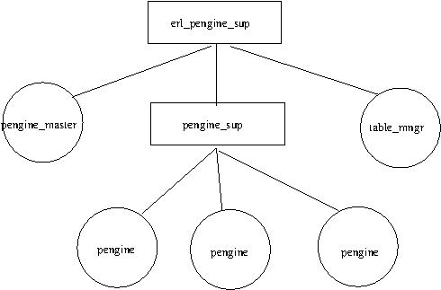

# erl_pengine (v0.1.0)

[](https://travis-ci.org/Limmen/erl_pengine.svg?branch=master)

[](https://hex.pm/packages/erl_pengine)
      
## Overview

**ErlangPengine**

Erlang client to prolog pengine server.
For more information about the pengine project see the following links.

* [http://pengines.swi-prolog.org/docs/documentation.html](http://pengines.swi-prolog.org/docs/documentation.html)
* [http://www.swi-prolog.org/pldoc/doc_for?object=section(%27packages/pengines.html%27)](http://www.swi-prolog.org/pldoc/doc_for?object=section(%27packages/pengines.html%27))
* [paper](https://arxiv.org/abs/1405.3953)

EDoc link:

* [Edoc](https://limmen.github.io/erl_pengine/index.html) 

### Features

Pengines is short for Prolog Engines, it's a package which allows you to talk to remote prolog servers in a simple
and effective way. 

With a pengines client you can access pretty much the full prolog power remotely. You write your pengine-server and
make it export the predicates you desire as accessible from remote and then you can access it.

If you are looking for just basic prolog access, you should look at [erlog](https://github.com/rvirding/erlog) which is 
a prolog in interpreter for a subset of the prolog standard in erlang.

If you need access to full prolog-power like access to a CLP-solver, a semantic-web server or similar, a pengine-client is a good
way to do it.

Other pengine clients:

* [JavaScriptPengine](http://pengines.swi-prolog.org/docs/index.html)
* [RubyPengine](https://github.com/simularity/RubyPengine)
* [JavaPengine](https://github.com/simularity/JavaPengine)

### Useful Modules

* `erl_pengine.erl`: entrypoint module, application callback module, start with `application:start(erl_pengine)`
* `pengine.erl`: main API for a created slave-pengine
* `pengine_master`: API for administering active pengines and also creating new ones

## Table of Contents

   * [erl_pengine (v0.1.0)](#erl_pengine-v010)
      * [Overview](#overview)
         * [Features](#features)
         * [Useful Modules](#useful-modules)
      * [QuickStart Usage](#quickstart-usage)
      * [Architecture](#architecture)
      * [API](#api)
         * [Create](#create)
            * [create_options](#create_options)
            * [create_response](#create_response)
            * [pengine_master:create_pengine/2](#pengine_mastercreate_pengine2)
         * [Destroy](#destroy)
            * [destroy_response](#destroy_response)
            * [pengine:destroy/1](#penginedestroy1)
         * [Ask](#ask)
            * [query_options](#query_options)
            * [ask_response](#ask_response)
            * [pengine:ask/3](#pengineask3)
            * [pengine:next/1](#penginenext1)
         * [Ping](#ping)
            * [ping_response](#ping_response)
            * [pengine:ping/2](#pengineping2)
         * [Receive Pengine Output](#receive-pengine-output)
            * [output_response](#output_response)
         * [Respond to Pengine Prompt](#respond-to-pengine-prompt)
            * [prompt_response](#prompt_response)
            * [respond/2](#respond2)
         * [pengine_master](#pengine_master)
            * [abort/stop](#abortstop)
               * [abort_response](#abort_response)
               * [stop_response](#stop_response)
               * [pengine_master:abort/1 and <code>pengine_masterstop/1</code>](#pengine_masterabort1-and-pengine_masterstop1)
         * [list and lookup active pengines](#list-and-lookup-active-pengines)
            * [pengine_master:list_pengines/1](#pengine_masterlist_pengines1)
            * [pengine_master:lookup_pengine/1](#pengine_masterlookup_pengine1)
            * [Examples](#examples)
         * [kill all pengines](#kill-all-pengines)
            * [pengine_master:kill_all_pengines/0](#pengine_masterkill_all_pengines0)
         * [Errors](#errors)
            * [error_response](#error_response)
            * [died_response](#died_response)
            * [Examples](#examples-1)
      * [Examples](#examples-2)
      * [Contribute](#contribute)
         * [Most useful project commands](#most-useful-project-commands)
      * [Author &amp; Maintainer](#author--maintainer)
      * [Copyright and license](#copyright-and-license)


## QuickStart Usage

 **Add to rebar3 project**

The package is published at [hex.pm](hex.pm)
You can add  it to your project by putting the following to your list of dependencies in `rebar.config`:
 ```erlang
   {deps, [
          {erl_pengine, "0.1.0"}
   ]}.

 ```
 
 Or add it as a github dependency:
 
 ```erlang
  {deps, [
         {erl_pengine, {git, "https://github.com/Limmen/erl_pengine", {branch, "master"}}}
  ]}.
  ```
 
 **Start application**
 
 >>  Starts application together with dependencies
  ```erlang
 application:ensure_all_started(erl_pengine).
  ```
 
 **Basic Usage**
 
 >> Connect to prolog-pengine server at http://127.0.0.1:4000/pengine and create a slave-pengine with default create-options
  and issue queries
   ```erlang
   %% create pengine with default options #{}, Pid = pid of pengine process, Id = pengine unique binary identifier.
   %% as default no create-query is sent upon create request
   {{ok, {Pid, Id}}, {no_create_query}} = pengine_master:create_pengine("http://127.0.0.1:4000/pengine", #{}).      
   
   %% Query pengine_master of list of active slave pengines
   [{Pid, Id}] = pengine_master:list_pengines().
   
   %% query pengine for a solution to member(X, [1,2]), MoreSolutions is a boolean indicating if more solutions exists.
   {success, Id, [[1]], MoreSolutions = true} = pengine:ask(Pid, "member(X, [1,2])", #{template => "[X]", chunk => "1"}).
   
   %% ask pengine for next and last solution. Default option when pengine is created is that it will destroy itself upon
   %% query completion. This can be configured in create options.
   {{success, Id, [[2]], false}, {pengine_destroyed, Reason}} = pengine:next(Pid).
   
   %% When remote-pengine is destroyed also the erlang-process representing the pengine terminates
   [] = pengine_master:list_pengines().          
   ```   
## Architecture
 
 
  
  `pengine_master` contains the API for creating new pengines, aborting pengines or getting a list of active slave-pengines.
  
  Each remote slave_pengine is represented by a erlang `pengine`-process which contains the API for querying or 
  destroying the pengine.

  Pengines are identified by their erlang-pids but you can also lookup pengines by their id from the pengine_master with
  `lookup_pengine(Id)` or `list_pengines()`.
## API

### Create

#### `create_options`

``` erlang
%% pengine create options
-type pengine_create_options():: #{
                              application => binary() | string(),
                              ask => binary() | string(),
                              template => binary() | string(),
                              chunk => integer(),
                              destroy => boolean(),
                              format => binary() | string(),
                              src_text => binary() | string(),
                              src_url => binary() | string()
                             }.
                             
%% default options
#{application => "pengine_sandbox", chunk => 1, destroy => true, format => json}.
```
#### `create_response`

```erlang
%% response to a create request
-type create_response()::{{ok, {PengineProcess :: pid(), Id :: binary()}}, {no_create_query}} |
                         {{ok, {PengineProcess :: pengine_destroyed, Id :: binary()}}, {no_create_query}} |
                         {{ok, {PengineProcess :: pid(), Id :: binary()}}, {create_query, query_response()}} |
                         {{ok, {PengineProcess :: pengine_destroyed, Id :: binary()}}, {create_query, query_response()}} |
                         {{error, {max_limit, Reason :: any()}}, destroy_response()}.
```

#### `pengine_master:create_pengine/2`

```erlang
-spec create_pengine(string(), pengine:pengine_create_options()) ->
                            pengine:create_response() | pengine:error_response().
create_pengine(Server, CreateOptions) ->
    ...   
```

The pengine server can specify the max number of pengines a single client is allowed to create. This is not enforced by 
the server, it's up to the client implementation so its more of a "hint" by the server. This is however enforced by erl_pengine
if you try to create a pengine whilst having more than the max-limit number of active pengines it will destroy the pengine and
return an error. 

To save one roundtrip its possible to issue a query directly upon creation of the pengine, e.g:
```erlang
%% Options to be passed to pengine upon creation
Options = #{destroy => true, application => "pengine_sandbox", chunk => 2, format => json, ask => "member(X, [1,2])", template => "[X]"}.

%% Ask query upon creation, chunking the result to max chunk size 2. Pengine is destroyed after query completion.
{{ok, {pengine_destroyed, Id}}, {create_query, {{success, Id, [[1],[2]], false}, {pengine_destroyed, _Reason}}}} = 
 pengine_master:create_pengine("http://127.0.0.1:4000/pengine", Options). 
```
It is also possible to inject prolog source-code into the pengine upon creation.
```erlang
%% Options to be passed to pengine upon creation
Options = #{destroy => false, application => "pengine_sandbox", chunk => 1, format => json, src_text => "pengine(pingu).\n"}.

%% Create slave_pengine with Options and inject the source
{{ok, {Pid, Id}}, {no_create_query}} = pengine_master:create_pengine("http://127.0.0.1:4000/pengine", Options).

%% Query pengine of the injected source
{success, Id1, [[<<"pingu">>]], MoreSolutions = false} = pengine:ask(P1, "pengine(X)", #{template => "[X]", chunk => "1"}).
```
A typical example of injecting source is ofcourse to inject whole source-files or point to a source-url.

`src_text.pl`:
``` prolog
pengine_child(pingu).
pengine_child(pongi).
pengine_child(pingo).
pengine_child(pinga).

pengine_master(papa, pingu).
pengine_master(mama, pongi).
```

```erlang
%% Read prolog source into binary
{ok, File} = file:read_file("src_text.pl").

%% Options to be passed to pengine upon creation
Options = #{destroy => false, application => "pengine_sandbox", chunk => 1, format => json, src_text => File}.

%% Inject prolog source upon creation
{{ok, {Pid, Id}}, {no_create_query}} = pengine_master:create_pengine("http://127.0.0.1:4000/pengine", Options)

%% Ask pengine a query of the injected source
{success, Id, [[<<"pingu">>], [<<"pongi">>], [<<"pingo">>], [<<"pinga">>]], false} = 
 pengine:ask(Pid, "pengine_child(X)", #{template => "[X]", chunk => "10"}).
 
 %% It is also possible to inject source by specifying a url, just send a options like the following:
 Options = #{destroy => true, application => "pengine_sandbox", chunk => 1, format => json, src_url => "http://127.0.0.1:4000/src_url.pl"}
```
### Destroy

#### `destroy_response`

```erlang
%% response if pengine to send request to was destroyed after the request
-type destroy_response()::{pengine_destroyed, Reason :: any()}.
```

#### `pengine:destroy/1`

```erlang
-spec destroy(pid()) -> destroy_response() | error_response().
destroy(Pengine) ->
 ...
```

destroy function takes a pid of a pengine process and sends a request to the prolog server to destroy the pengine and then
it the erlang process will also terminate. destroy function is typically only necessary if the pengine was created with
option `destroy=false` otherwise the pengine will destroy itself after query completion.

```erlang
%% Create pengine with default options
{{ok, {Pid, Id}}, {no_create_query}} = pengine_master:create_pengine("http://127.0.0.1:4000/pengine", #{}).

%% destroy pengine
{pengine_destroyed, _Reply} = pengine:destroy(Pid).
```

### Ask 

#### `query_options`

```erlang
%% query_options to the ask() function.
-type query_options():: #{
                     template := string(),
                     chunk := integer()
                    }.
```

#### `ask_response`

```erlang
%% response to a ask-request
-type ask_response():: {query_response(), destroy_response()} |
                       query_response() |
                       {output_response(), destroy_response()} |
                       output_response() |
                       {prompt_response() | destroy_response()} |
                       prompt_response() |
                       died_response().
```
#### `pengine:ask/3`

```erlang
-spec ask(pid(), string(), query_options()) -> ask_response() | error_response().
ask(Pengine, Query, Options) ->
 ...
```
The ask function takes a pengine process, a query and query options as input and will send a query request to the slave_pengine.
```erlang
%% Ask pengine for one solution at a time
{success, Id, [[1]], MoreSolutions = true} = pengine:ask(Pid, "member(X, [1,2])", #{template => "[X]", chunk => "1"}).
```

#### `pengine:next/1`

```erlang
-spec next(pid()) -> ask_response() | error_response().
next(Pengine) ->
...
```
The next function will ask the pengine for more solutions to the currently active query

```erlang
%% Ask pengine for next solution of the active query (if you call next() with no active query you'll get a protocol error)
 {{success, Id, [[2]], MoreSolutions = false}, {pengine_destroyed, _}} = pengine:next(Pid).
```

### Ping

#### `ping_response`

```erlang
%% response for ping request
-type ping_response():: {ping_response, Id :: binary(), Data :: map()} |
                        {ping_interval_set, Interval :: integer()} |
                        died_response().
```

#### `pengine:ping/2`

```erlang
-spec ping(pid(), integer()) -> ping_response() | error_response().
ping(Pengine, Interval) ->
...
```
Sends a ping request to the pengine

If Interval = 0, send a single ping. If Interval > 0, set/change periodic ping event, if 0, clear periodic interval.

Slave-pengines are destroyed by the server after ~5min to avoid runaway computations and stacking up pengines.
Periodic pinging of a slave-pengine is a way to have the state of active pengines of `pengine_master` more up to date
since it will let you notice as soon as a pengine is aborted and can then update the state and terminate also the erlang
process.

```erlang
%% Send a single ping request to the pengine, to ping it periodically set interval > 0
16> pengine:ping(Pid, 0).
{ping_response,<<"bbe8836f-8eae-45d5-853e-e55ea3b92f6b">>,
               #{<<"id">> => 11,
                 <<"stacks">> =>
                     #{<<"global">> =>
                           #{<<"allocated">> => 61424,
                             <<"limit">> => 268435456,
                             <<"name">> => <<"global">>,<<"usage">> => 2056},
                       <<"local">> =>
                           #{<<"allocated">> => 28672,
                             <<"limit">> => 268435456,
                             <<"name">> => <<"local">>,<<"usage">> => 1408},
                       <<"total">> =>
                           #{<<"allocated">> => 120808,
                             <<"limit">> => 805306368,
                             <<"name">> => <<"stacks">>,<<"usage">> => 4128},
                       <<"trail">> =>
                           #{<<"allocated">> => 30712,
                             <<"limit">> => 268435456,
                             <<"name">> => <<"trail">>,<<"usage">> => 664}},
                 <<"status">> => <<"running">>,
                 <<"time">> =>
                     #{<<"cpu">> => 0.001505787,
                       <<"epoch">> => 1496089942.8789568,
                       <<"inferences">> => 197}}}
```

### Receive Pengine Output
Slave-Pengines can send output back to their masters by using the prolog predicate `pengine_output/1` 
#### `output_response`
```erlang
%% response to pengine-output
-type output_response()::{{output, PrologOutput :: any()}, {pull_response, ask_response()}}.
```

Example two prolog outputs from the pengine:

```prolog
output_test:-
    pengine_output(output_test_success).
    
output_test2(done):-
    pengine_output(output_test2_first),
    pengine_output(output_test2_second).
```

When a slave-pengine responds with output the erl_pengine will automatically call pull_response to receive all outputs
since there might be multiple.


```erlang
%% ask pengine for output_test which will just return a single output and no solution
    {
      {
        output,<<"output_test_success">>
      },
      {
        pull_response,
        {
          {
            success,
            Id,
            [[]],
            false
          },
          {
            pengine_destroyed, 
            _Reason1
          }
        }
      }
    } 
        = pengine:ask(Pid, "output_test", #{template => "[]", chunk => "1"}).
     
%% ask pengine for output_test2 which will return two outputs and also a single solution 'done'.
    {
      {output,<<"output_test2_first">>},
      {
        pull_response,
       {
         {
           output,<<"output_test2_second">>},
         {
           pull_response,
          {
            {
              success,
              Id,
              [[<<"done">>]],
              false
            },
         {
           pengine_destroyed,
          _Reason2
         }
          }
         }
       }
      }
    } 
        = pengine:ask(Pid, "output_test2(X)", #{template => "[X]", chunk => "1"}).
```

### Respond to Pengine Prompt

#### `prompt_response`

```erlang
%% response to a pengine-prompt
-type prompt_response()::{prompt, Id :: binary(), Data :: binary()}.
```
#### `respond/2`

```erlang
-spec respond(pid(), list()) -> ask_response() | error_response().
respond(Pengine, PrologTerm) ->
 ...
```

`respond/2` lets you respond to a pengine-slave that has sent you a prompt waiting for input with the prolog predicate 
`pengine_input/2`

Example:

prolog-prompt from the pengine:

```prolog
prompt_test(prompt_test_success(Input)):-
	pengine_input(prompt_test, Input).
```
Response:
```erlang
%% Receive prompt from slave-pengine
{prompt, Id, <<"prompt_test">>} = pengine:ask(Pid, "prompt_test(X)", #{template => "[X]", chunk => "1"}).

%% Respond to prompt with prolog atom 'pengine'
{{success, Id1, 
      [[
        #{
           <<"args">> := [<<"pengine">>], 
           <<"functor">> := <<"prompt_test_success">>
         }
       ]], MoreSolutions = false}, {pengine_destroyed, _Reason}} = pengine:respond(Pid, "pengine").
```

### pengine_master

#### abort/stop

##### `abort_response`

```erlang
%% response to abort-request
-type abort_response()::{aborted, Id :: binary()} |
                        {{aborted, Id :: binary()}, destroy_response()} |
                        died_response().
```
##### `stop_response`

```erlang
%% response to stop-request
-type stop_response()::{stopped, Id :: binary()} |
                       died_response().
```

##### `pengine_master:abort/1` and `pengine_masterstop/1`

Sometimes a query to a pengine might take long time and you dont want to wait for the solution but want to interrupt
the busy pengine and free your erlang-process which will be stuck waiting for a response.

`stop/1` gently tried to ask the pengine to stop and `abort/1` terminates the pengine's query by force.

```erlang
-spec abort(binary(), string() | binary()) -> pengine:abort_response() | pengine:error_response().
abort(Id, Server) ->
 ...
```

```erlang
-spec stop(binary(), string() | binary()) -> pengine:stop_response() | pengine:error_response().
stop(Id, Server) ->
 ...
```
Example: 

```erlang
%% Attempt to stop pengine-query
    spawn(fun() -> 
                  pengine:ask(P1, "member(X, [1,2])", #{template => "[X]", chunk => "1"})
          end),
    Res = pengine_master:stop(Id1, "http://127.0.0.1:4000/pengine"),
    case Res of 
        {stopped, Id1} -> ok;        
        {error, Id1, _Reason, _Code} -> ok %% error if nothing to stop      
    end.

%% Abort pengine by force (should always succeed)
    Self = self(),
    spawn(fun() -> 
                  {{aborted, Id1}, {pengine_destroyed, _Reason1}} = pengine:ask(P1, "long_query(X)", #{template => "[X]", chunk => "1"}),
                  Self ! aborted
          end),    
    {pengine_died,_Reason} = pengine_master:abort(Id1, "http://127.0.0.1:4000/pengine"),
    receive
        aborted ->
            ok    
    end.
```
### list and lookup active pengines

#### `pengine_master:list_pengines/1`

```erlang
-spec list_pengines() -> list().
list_pengines()->
```

#### `pengine_master:lookup_pengine/1`
```erlang
-spec lookup_pengine(binary()) -> pid().
lookup_pengine(Id)->
```

#### Examples

```erlang
%% Ask pengine_master for a list of active slave pengines.
%% Note that the remote slave_pengines need not necessarily be active, if you dont ping the slave_pengine periodically
%% you don't know if it has died.
[{Pid1, Id1}, {Pid2, Id2}] = pengine_master:list_pengines()

%% Pengines are identified by their Pid in erl_pengine, you can lookup a Pid given a slave_pengine Id
Pid = pengine_master:lookup_pengine(Id)
```

### kill all pengines

You can always kill pengines manually by their Pids and `pengine:destroy/1` but for convenience pengine master exports a 
function to kill all pengines in one go (it will kill both erlang-process and the remote slave-pengine)

#### `pengine_master:kill_all_pengines/0`

```erlang
-spec kill_all_pengines() -> ok.
kill_all_pengines()->
```

```erlang
ok = pengine_master:kill_all_pengines().
```

### Errors

It happens that errors occur if the Prolog Transport Protocol (PLTP) and its associated finite-state-machine of states
and transitions is not followed that the pengine will respond with error messages.

It might also happen that you try to send a query to a pengine that is already dead.

#### `error_response`
```erlang
%% response when pengine signaling that some error occurred
-type error_response()::{error, Id :: binary(), Reason :: binary(), Code :: binary()}.
```

#### `died_response`

```erlang
%% response if pengine to send request to was dead before request could be handled
-type died_response()::{pengine_died, Reason :: any()}.
```

#### Examples

```erlang
%% attempt to respond to a prompt that does'nt exist
{error, Id2, _Reason2, <<"protocol_error">>} = pengine:respond(P2, "pengine"). %% no prompt left to respond
```

```erlang
%% abort a pengine by force will also kill it.
{pengine_died,_Reason2} = pengine_master:abort(Id1, "http://127.0.0.1:4000/pengine").
```

## Examples

See `/examples` for two simple example projects, one project uses prolog as a constraint-solver for the sudoku-problem 
and the other project uses prolog as a rdf triple-store. 

```erlang
%% solve_sudoku will create pengine with the given source and query it for a solution of the sudoku-problem specified in Src
sudoku_solver:solve_sudoku(Src).
 [[9,8,7,6,5,4,3,2,1],
  [2,4,6,1,7,3,9,8,5],
  [3,5,1,9,2,8,7,4,6],
  [1,2,8,5,3,7,6,9,4],
  [6,3,4,8,9,2,1,5,7],
  [7,9,5,4,6,1,8,3,2],
  [5,1,9,2,8,6,4,7,3],
  [4,7,2,3,1,9,5,6,8],
  [8,6,3,7,4,5,2,1,9]]
 4> 

%% supervises will create pengine and query it for supervises(X,Y).
 5> semweb:supervises().
 [{<<"http://www.limmen.kth.se/ontologies/erl_pengine#pengine_sup">>,
  supervises,
  <<"http://www.limmen.kth.se/ontologies/erl_pengine#pengine">>},
  {<<"http://www.limmen.kth.se/ontologies/erl_pengine#erl_pengine_sup">>,
  supervises,
  <<"http://www.limmen.kth.se/ontologies/erl_pengine#table_mngr">>},
  {<<"http://www.limmen.kth.se/ontologies/erl_pengine#erl_pengine_sup">>,
  supervises,
  <<"http://www.limmen.kth.se/ontologies/erl_pengine#pengine_sup">>},
  {<<"http://www.limmen.kth.se/ontologies/erl_pengine#erl_pengine_sup">>,
  supervises,
  <<"http://www.limmen.kth.se/ontologies/erl_pengine#pengine_master">>}]
 6>
```

## Contribute

Contributions are welcome, for bugreports please use github issues.

It's hard to think of all edge-cases and cover with tests so please if you find a bug, open up a issue or fork and create a 
PR.

### Most useful project commands

It's a rebar3 project so all commands listed here: [rebar3 commands](https://www.rebar3.org/docs/commands) are available.

```bash
# build
$ ./rebar3 compile

# remove temporary files
$ ./rebar3 clean

# run unit tests
$ ./rebar3 eunit

# run system tests, note that the test-suite uses absolute path to a prolog-pengine server.
$ ./rebar3 ct 

# run static code analysis
$ ./rebar3 dialyzer 

# alias to run all tests
$ ./rebar3 testall

# alias to run the ci-check which travis will run upon git push
$ ./rebar3 ci

# validate codebase, runs: tests, linters, static code analysis
$ ./rebar3 validate

# Generate documentation with edoc
$ ./rebar3 edoc

# Start shell with application loaded
$ ./rebar3 shell

# Run release
$ ./rebar3 run

```

Make sure that any PR first passes dialyzer, linter and tests.
 
## Author & Maintainer

Kim Hammar <kimham@kth.se>

## Copyright and license

[LICENSE](LICENSE.md)

MIT

(C) 2017, Kim Hammar